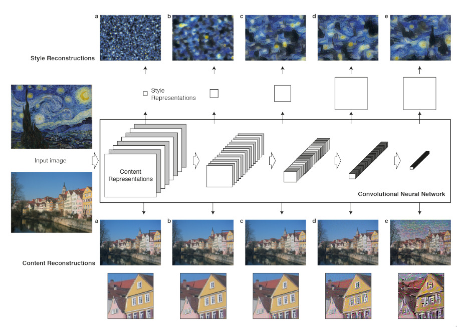
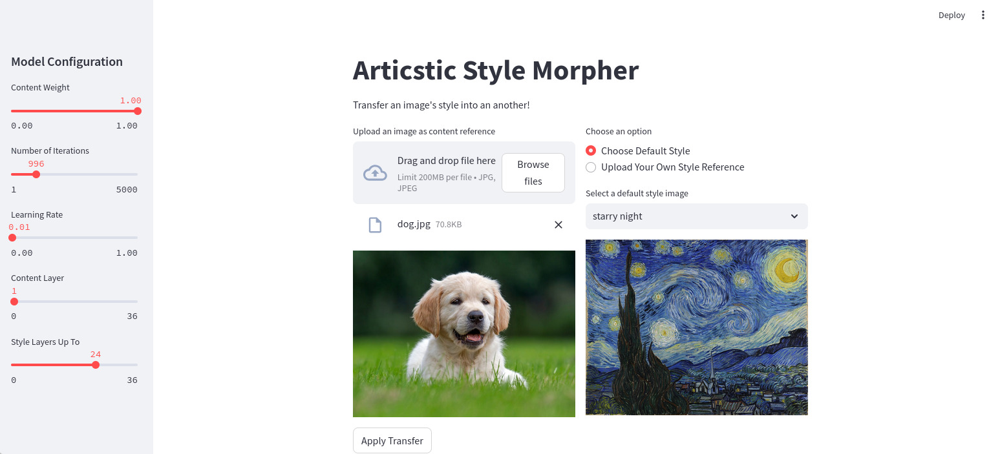
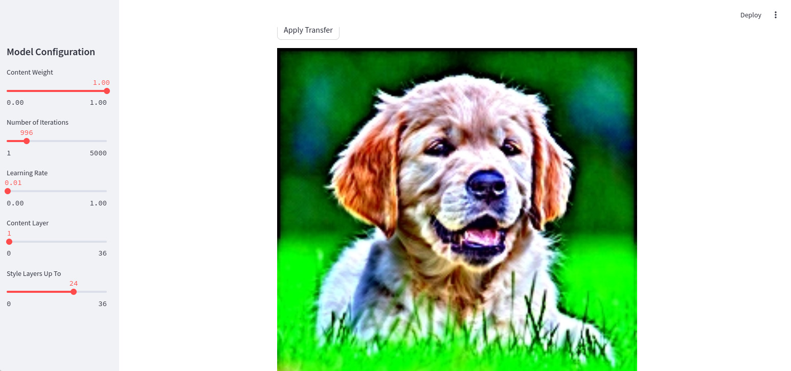

# Artististic Style Morpher

This project implements the Neural Style Transfer algorithm based on the paper ["A Neural Algorithm of Artistic Style"](https://arxiv.org/abs/1508.06576) by Gatys et al. It allows users to apply the style of one image to the content of another, creating unique artistic renditions.

## Concept

Neural Style Transfer is a technique that uses convolutional neural networks to separate and recombine the content and style of different images. The process involves:

- Using a pre-trained convolutional neural network (usually VGG19) to extract content and style representations from images.
- Defining a loss function that measures the differences between the content, style, and generated images.
- Optimizing a new image to minimize this loss function, effectively merging the content of one image with the style of another.



Figure 1: Diagram illustrating the Neural Style Transfer process. The content image (bottom left) and style image (top left) are passed through a convolutional neural network. Content and style representations are extracted at different layers. These representations are then used to guide the transformation of a generated image (typically a white noise image), resulting in style reconstructions (top) and content reconstructions (bottom) at various levels of the network. (Gatys et al., 2015)

## Features

- Interactive Streamlit app for easy experimentation
- Customizable model parameters
- Upload your own content and style images
- Pre-defined style options (Van Gogh and Picasso)
- Jupyter notebooks demonstrating the proof of concept

## Installation

1. Clone this repository:
   ```
   git clone https://github.com/BlcMed/artististic-style-morpher.git
   cd artististic-style-morpher
   ```

2. Create and activate a python virtual environment
   ```
   py -m venv venv
   source venv/bin/activate
   ```

3. Install the required dependencies:
   ```
   pip install -r requirements.txt
   ```

## Usage

1. Run the Streamlit app:
   ```
   streamlit run main.py
   ```

2. Open the provided URL in your web browser

3. Use the interface to:
   - Upload content and style images
   - Choose from pre-defined styles
   - Adjust model parameters
   - Generate stylized images


Figure 2: the streamlit interface, the left sidebar allows us to tweak the model parameters for easy experimenting.


Figure 3: a dog image generated from a white noise image using only the content (the originla dog image)

## Model Parameters

- Content Weight: Adjusts the emphasis on the content image
- Content Layer: Selects the layer used for content reconstruction
- Style Layers: Selects the layers used for style reconstruction
- Learning Rate: Controls the speed of optimization
- Number of Iterations: Determines how many optimization steps to perform

## Contributing

Contributions are welcome! Please feel free to submit a Pull Request.

## License

This project is licensed under the GPLv3.0 License - see the [LICENSE](LICENSE) file for details.

## Acknowledgements

- Leon A. Gatys, Alexander S. Ecker, and Matthias Bethge for their paper on Neural Style Transfer
